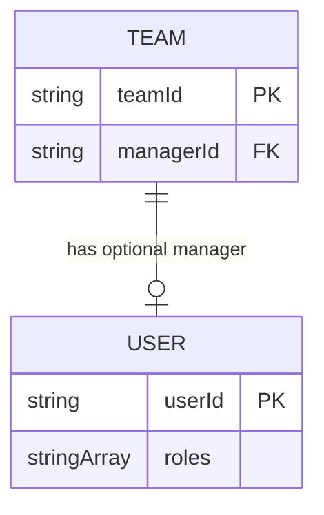
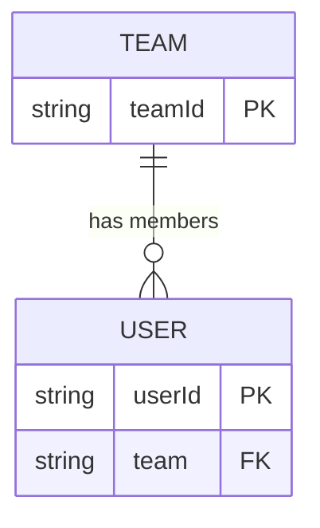
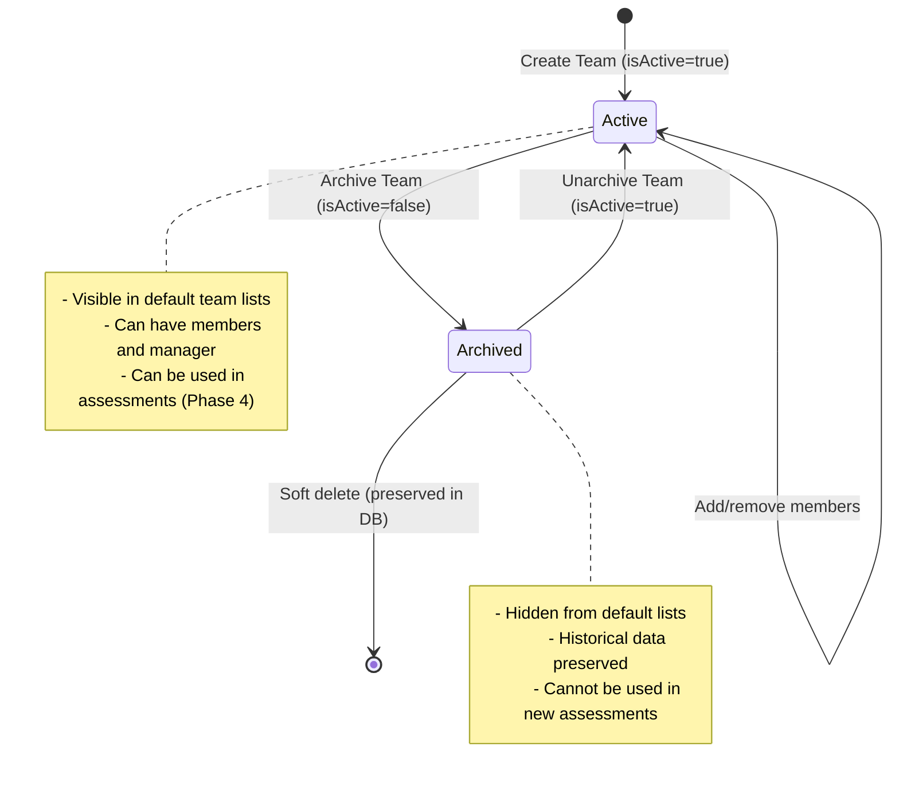
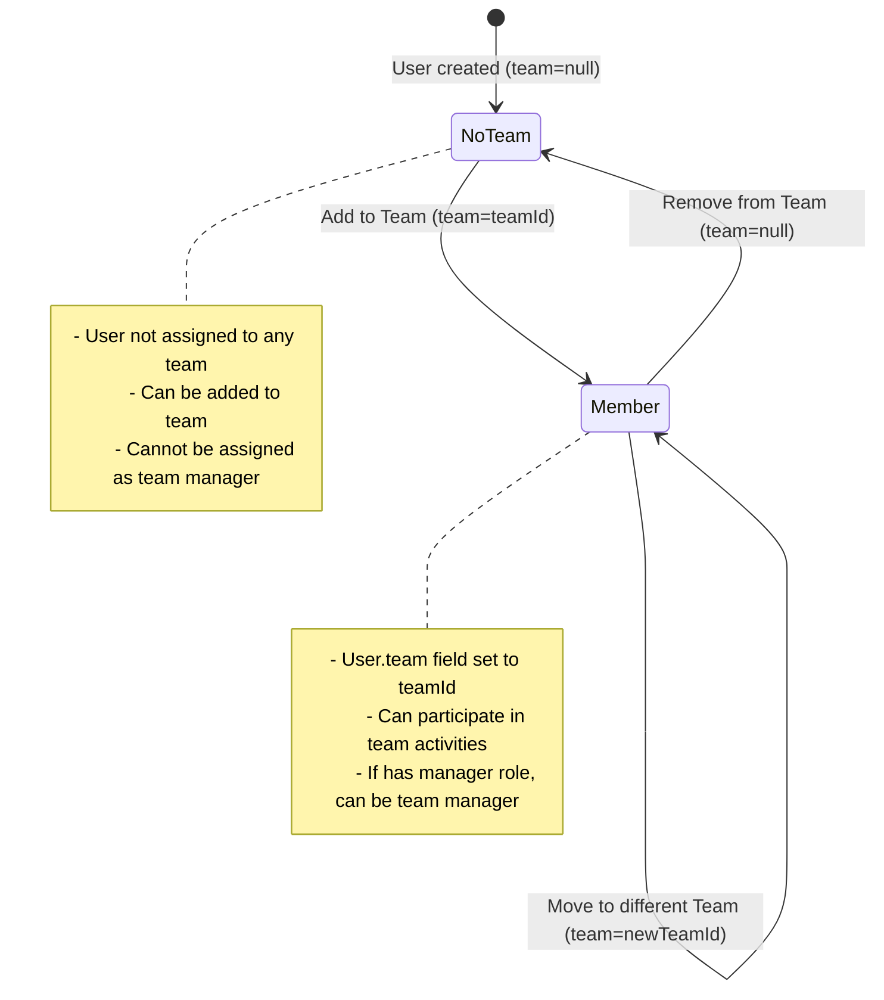

# Data Model: Administrator Team Management

**Feature**: 005-team-management
**Date**: 2025-11-24
**Purpose**: Define data entities, relationships, validation rules, and state transitions

## Entity Definitions

### Team

Represents an organizational unit for grouping users and managing team-based workflows.

**DynamoDB Table**: `Teams` (from 001-dynamodb-setup)
**Partition Key**: `teamId` (String)
**GSI**: `managerId-index` on `managerId` field

**Fields**:

| Field | Type | Required | Description | Validation | Example |
|-------|------|----------|-------------|------------|---------|
| `teamId` | String | Yes | Unique team identifier | 2-50 chars, alphanumeric + hyphens, no spaces | `"engineering-team"`, `"sales-west"` |
| `name` | String | Yes | Human-readable team name | 2-100 chars, any printable characters | `"Engineering Team"`, `"Sales - West Coast"` |
| `managerId` | String | No | userId of team manager (email) | Valid email format, user must have "manager" role, user must be active | `"manager@example.com"` or `null` |
| `isActive` | Boolean | Yes | Soft delete flag (NEW - from research.md) | Always `true` or `false`, default `true` | `true` |
| `createdAt` | Number | Yes | Unix timestamp (ms) of creation | Positive integer | `1700000000000` |
| `updatedAt` | Number | Yes | Unix timestamp (ms) of last update | Positive integer, >= createdAt | `1700000001000` |
| `createdBy` | String | Yes | userId of administrator who created team | Valid email format | `"admin@example.com"` |

**Derived Fields** (calculated, not stored):
- `memberCount`: Number of active users with `team === teamId`
- `members`: Array of User objects with `team === teamId` and `isActive === true`
- `activeAssessment`: Most recent assessment plan with incomplete assessments (Phase 4 implementation)

**Indexes**:
- Primary: `teamId` (partition key)
- GSI: `managerId-index` for querying teams by manager

**Example Document**:
```json
{
  "teamId": "engineering-platform",
  "name": "Engineering - Platform Team",
  "managerId": "alice@example.com",
  "isActive": true,
  "createdAt": 1700000000000,
  "updatedAt": 1700000100000,
  "createdBy": "admin@example.com"
}
```

---

### User (existing, modified for team management)

**DynamoDB Table**: `Users` (from 001-dynamodb-setup, 004-user-management)
**Partition Key**: `userId` (String, email address)

**Relevant Fields for Team Management**:

| Field | Type | Required | Description | Validation | Notes |
|-------|------|----------|-------------|------------|-------|
| `userId` | String | Yes | Email address (Cognito username) | Valid email format | Partition key |
| `name` | String | Yes | Full name from Microsoft 365 | 1-200 chars | Display in member selectors |
| `roles` | String[] | Yes | Array of role strings | Must include `["manager"]` for team managers | Used to validate manager assignment |
| `team` | String | No | teamId of assigned team | Must match existing teamId, null if no team | Updated by add/remove member operations |
| `isActive` | Boolean | Yes | User active status | Must be `true` to assign as manager | Prevents inactive manager assignment |

**Team-Related Constraints**:
- User can belong to maximum one team at a time (FR-010)
- When user.team is updated, previous team membership is automatically cleared
- Managers can be assigned to multiple teams (one user, multiple Teams.managerId references)
- Team managers must be team members (SC-009 enforcement: cannot remove manager from members)

---

## Relationships

### Team → Manager (many-to-one, optional)



**Description**: A team can have zero or one manager. A user can be manager of multiple teams.

**Implementation**:
- Teams table stores `managerId` field (foreign key to Users.userId)
- Query: `SELECT * FROM Teams WHERE managerId = :userId` (uses managerId GSI)
- Constraint: managerId must reference active user with "manager" role

**Navigation**:
- Forward: Get team's manager: `GetItem(Users, managerId)`
- Reverse: Get teams managed by user: `Query(Teams, managerId-index, managerId === userId)`

---

### Team → Members (one-to-many, derived)



**Description**: A team can have zero or more members. A user can belong to zero or one team (FR-010).

**Implementation**:
- Users table stores `team` field (foreign key to Teams.teamId)
- Query: `SELECT * FROM Users WHERE team = :teamId AND isActive = true`
- Constraint: User can have only one team value (null or teamId)

**Navigation**:
- Forward: Get team's members: `Query/Scan(Users, team === teamId AND isActive === true)`
- Reverse: Get user's team: `GetItem(Teams, user.team)` if user.team is not null

**Operations**:
- Add member: `UpdateItem(Users, userId, SET team = :teamId)`
- Remove member: `UpdateItem(Users, userId, SET team = null)`
- Move member: `UpdateItem(Users, userId, SET team = :newTeamId)` (automatically removes from old team)

---

### Team → Active Assessment (one-to-one, optional, Phase 4)

**Description**: A team can have zero or one active assessment plan. Placeholder in Phase 3.

**Implementation (Phase 4)**:
- Query Assessments table: `Query(Assessments, teamId-status-index, teamId === :teamId, status IN ['not_started', 'in_progress'])`
- Derive most recent assessment plan with incomplete assessments
- Return null if no active assessments found

**Phase 3 Implementation**:
- Return `activeAssessment: null` in team list responses
- Add `// TODO: Phase 4 - implement active assessment query` comment

---

## Validation Rules

### Team Creation (User Story 1)

**Input Validation**:
```typescript
interface CreateTeamRequest {
  teamId: string;    // Required, 2-50 chars, alphanumeric + hyphens, lowercase preferred
  name: string;      // Required, 2-100 chars, any printable characters
}
```

**Server-Side Validation**:
1. `teamId` format: `/^[a-z0-9-]{2,50}$/` (lowercase alphanumeric + hyphens)
2. `teamId` uniqueness: Check DynamoDB, return 409 if exists
3. `name` length: 2-100 characters
4. `name` format: Allow letters, numbers, spaces, punctuation (printable chars only)
5. Authorization: User must have "admin" role

**Error Responses**:
- 400: Invalid teamId format or name length
- 401: Missing or invalid JWT token
- 403: User does not have admin role
- 409: Team with teamId already exists

---

### Manager Assignment (User Story 3)

**Input Validation**:
```typescript
interface AssignManagerRequest {
  managerId: string | null;  // Email address or null to unassign
}
```

**Server-Side Validation**:
1. `managerId` format: Valid email address if not null
2. User existence: GetItem(Users, managerId) must exist
3. User role: `user.roles.includes('manager')` must be true (FR-007)
4. User status: `user.isActive === true` must be true (FR-016, SC-008)
5. Authorization: Requestor must have "admin" role

**Error Responses**:
- 400: Invalid email format
- 400: User does not have manager role (code: INVALID_MANAGER_ROLE)
- 400: User is deactivated (code: MANAGER_DEACTIVATED, SC-008)
- 401: Missing or invalid JWT token
- 403: User does not have admin role
- 404: Team not found or manager user not found

---

### Add Team Members (User Story 4)

**Input Validation**:
```typescript
interface AddMembersRequest {
  userIds: string[];  // Array of email addresses to add, 1-50 users per operation
}
```

**Server-Side Validation**:
1. `userIds` array: 1-50 items, all valid email formats
2. User existence: All userIds must exist in Users table
3. Batch operation: Update each user.team atomically
4. Previous team: Automatically cleared when user.team updated (FR-011)
5. Authorization: Requestor must have "admin" role

**Business Rules**:
- Users already assigned to this team: Idempotent, no error
- Users assigned to different team: Move to new team (FR-011)
- Inactive users: Allow (can be added to team, just can't be manager)

**Error Responses**:
- 400: Invalid request (empty array, invalid emails, >50 users)
- 401: Missing or invalid JWT token
- 403: User does not have admin role
- 404: Team not found or one or more users not found

---

### Remove Team Members (User Story 5)

**Input Validation**:
```typescript
interface RemoveMembersRequest {
  userIds: string[];  // Array of email addresses to remove, 1-50 users per operation
}
```

**Server-Side Validation**:
1. `userIds` array: 1-50 items, all valid email formats
2. User existence: All userIds must exist in Users table
3. Team manager check: If removing team manager, return 400 (SC-009, FR-013)
4. Batch operation: Set each user.team = null
5. Authorization: Requestor must have admin role

**Business Rules**:
- Cannot remove team manager while assigned: Must unassign manager first (FR-013)
- Historical data preservation: No cascade deletes on Assessments (FR-014)
- Users not in team: Idempotent, no error

**Error Responses**:
- 400: Invalid request (empty array, invalid emails, >50 users)
- 400: Cannot remove team manager (code: MANAGER_IS_MEMBER, SC-009)
- 401: Missing or invalid JWT token
- 403: User does not have admin role
- 404: Team not found or one or more users not found

---

## State Transitions

### Team Lifecycle



**State Definitions**:
- **Active** (`isActive === true`): Team is visible and can be used in workflows
- **Archived** (`isActive === false`): Team is hidden but data preserved, cannot be used in new workflows

**Transition Rules**:
1. **Create**: Always creates in Active state
2. **Archive**: Admin can archive active team, sets `isActive = false`
3. **Unarchive**: Admin can unarchive archived team, sets `isActive = true`
4. **No hard delete**: Constitution prohibits hard deletes for teams

---

### Team Membership State



**Transition Rules**:
1. **Add to Team**: User.team = null → User.team = teamId
2. **Remove from Team**: User.team = teamId → User.team = null
3. **Move Team**: User.team = teamA → User.team = teamB (automatic, FR-011)
4. **One team only**: User can never have multiple team values simultaneously (FR-010)

---

## Query Patterns

### Pattern 1: List All Active Teams

**Use Case**: Display team list in admin UI (FR-004)

**Query**:
```typescript
// DynamoDB Scan (acceptable for admin operations, <100 teams)
const result = await docClient.send(new ScanCommand({
  TableName: 'Teams',
  FilterExpression: 'isActive = :active',
  ExpressionAttributeValues: { ':active': true }
}));
```

**Response Enhancement**:
- For each team, calculate memberCount via Users table query
- For each team, get manager details via Users.GetItem(managerId)
- For each team, get activeAssessment (Phase 4, returns null in Phase 3)

**Performance**: O(n) teams, acceptable for n <100 per SC-002

---

### Pattern 2: Get Team Members

**Use Case**: Display team members for add/remove operations

**Query**:
```typescript
// Option 1: Scan with filter (if no GSI on team field)
const result = await docClient.send(new ScanCommand({
  TableName: 'Users',
  FilterExpression: 'team = :teamId AND isActive = :active',
  ExpressionAttributeValues: {
    ':teamId': teamId,
    ':active': true
  }
}));

// Option 2: Query with GSI (if team-index exists)
const result = await docClient.send(new QueryCommand({
  TableName: 'Users',
  IndexName: 'team-index',
  KeyConditionExpression: 'team = :teamId',
  FilterExpression: 'isActive = :active',
  ExpressionAttributeValues: {
    ':teamId': teamId,
    ':active': true
  }
}));
```

**Note**: Check 001-dynamodb-setup for GSI availability. Scan acceptable for admin operations.

---

### Pattern 3: Get Teams Managed by User

**Use Case**: Display teams for a specific manager

**Query**:
```typescript
const result = await docClient.send(new QueryCommand({
  TableName: 'Teams',
  IndexName: 'managerId-index',
  KeyConditionExpression: 'managerId = :managerId',
  FilterExpression: 'isActive = :active',
  ExpressionAttributeValues: {
    ':managerId': userId,
    ':active': true
  }
}));
```

**Performance**: O(1) via GSI, efficient for Phase 4 (manager viewing their teams)

---

### Pattern 4: Validate Manager Assignment

**Use Case**: Check if user can be assigned as team manager (FR-007, FR-016, SC-008)

**Query**:
```typescript
const user = await docClient.send(new GetItemCommand({
  TableName: 'Users',
  Key: { userId: managerId }
}));

// Validation checks
const isValid = user.Item &&
                user.Item.isActive === true &&
                user.Item.roles.includes('manager');
```

**Error Handling**:
- User not found: 404
- User not active: 400 (MANAGER_DEACTIVATED)
- User missing manager role: 400 (INVALID_MANAGER_ROLE)

---

## Migration Notes

### Schema Changes from 001-dynamodb-setup

**Teams Table**:
- ADD: `isActive` field (Boolean, default `true`) - NEW from research.md decision
- UPDATE: Clarify `managerId` is optional (can be null)
- NO CHANGE: teamId, name, managerId, createdAt, updatedAt, createdBy already exist

**Users Table**:
- NO CHANGE: team field already exists from 001-dynamodb-setup
- USAGE: team field updated by add/remove member operations

**Migration Strategy**:
1. Existing teams created without `isActive` field: Treat as `isActive === true` (default)
2. Update application code to set `isActive = true` on all new team creations
3. Backfill script (optional): Add `isActive = true` to all existing teams if needed

---

## Summary

### Core Entities
1. **Team**: Primary entity, stored in Teams table with soft delete support
2. **User**: Team membership tracked via `team` field, manager role validated for assignment
3. **Relationships**: Team → Manager (optional), Team → Members (derived from Users), Team → Active Assessment (Phase 4)

### Key Design Decisions (from research.md)
- Soft deletes for teams (isActive field) per constitution
- Single manager per team, flat structure (no nesting)
- Member count calculated on-the-fly from Users table
- Team membership derived from Users.team field (not stored in Teams)
- Active assessment query deferred to Phase 4

### Validation Priorities
- Team ID uniqueness (409 conflict)
- Manager role and active status enforcement (SC-008)
- Prevent manager removal while assigned (SC-009)
- Historical data preservation on member removal (FR-014)

### Next Steps
1. Generate API contracts (contracts/)
2. Implement type definitions (apps/api/src/types/teams.ts, apps/web/src/types/teams.ts)
3. Implement service layer (apps/api/src/services/team-service.ts)
4. Implement UI components (apps/web/src/components/admin/Team*.tsx)
